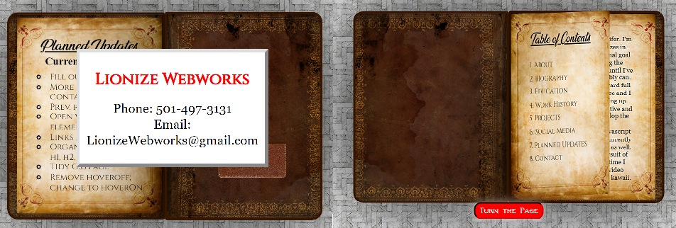

# A Portfolio Written in a Magical Book! #

    

This is the very first portfolio I ever made! I usually get way too excited about new projects and bite off more than I can chew, with this one being no exception- originally my grand idea was to have my portfolio be an *interactive magic shop!* Needless to say that was a bit above my head, so I settled for a magical book instead.

I wanted it to show how creative I am, which is something I pride myself on, as well as really highlight my skills with HTML/CSS and Javascript.

## Features ##
The book opens, the pages turn forward (with backwards turning and a functional Table of Contents in a later update), and my contact card pops out of the sleeve in the back. I haven't abandoned my magic shop idea by a longshot though, so keep your eyes peeled for it in the future!

### Updates ###

Most Recent Update: 2.0
**New Features**
*Turned off text selection
*Added page numbers
*Added completed resume
*Added Back Buttons
*Added links to Social Media

**Planned Updates/Fixes**
*TOC Links
*More Accessibility Features
*Make single page turns faster
*Improve contact card animation
*Add open with lock element? -maybe
*Add Back to TOC button??? (Way Later!!)
*Do something better/prettier with Social Media links
                *Add icon overlapping with link and name?*
*Plan for projects pages.
                *Just add extra pages and more to TOC?*
